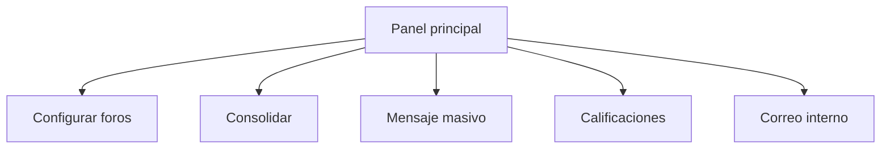
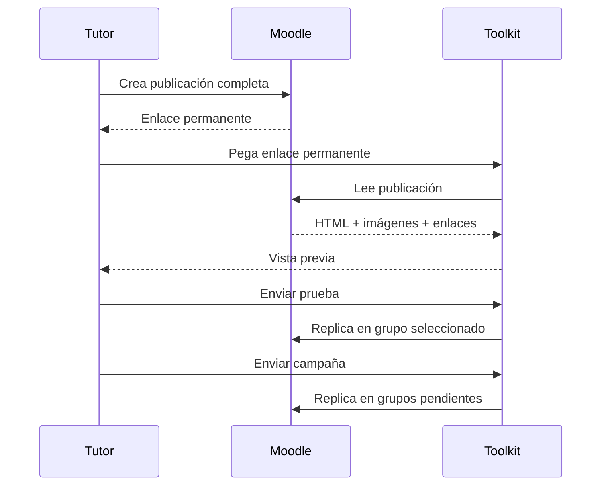

# Manual de Usuario
## Moodle Forum Toolkit - Gestor y Consolidador de Foros

**Versión:** 1.17.2  
**Autor:** Juan Pablo Moreno Ortiz  
**Licencia:** MIT

> Herramienta independiente y no oficial. No está afiliada ni respaldada por Moodle Pty Ltd ni por la Universidad Nacional Abierta y a Distancia.

---

## 1. Propósito

Moodle Forum Toolkit es un userscript para Tampermonkey diseñado para apoyar tareas docentes que normalmente requieren recorrer múltiples páginas Moodle: consolidación de foros, seguimiento de respuestas, mensajería, revisión de correo interno, calificación y algunas tareas de acompañamiento en SAI/AUREA.

La herramienta no reemplaza Moodle ni modifica los permisos asignados por la institución. Solo puede consultar o ejecutar acciones que el usuario autenticado ya tenga autorizadas.

## 2. Requisitos

- Google Chrome, Microsoft Edge u otro navegador compatible con Tampermonkey.
- Tampermonkey instalado y habilitado.
- Sesión institucional iniciada en Moodle.
- Permisos normales de tutor/docente para los cursos, foros y tareas que se desean utilizar.

No se requiere introducir usuario o contraseña dentro del Toolkit.

## 3. Instalación

1. Instale Tampermonkey.
2. En la configuración de la extensión, habilite la ejecución de scripts de usuario si el navegador lo solicita.
3. Abra:
   **https://raw.githubusercontent.com/JuanBiomedico/Moodle-Forum-Toolkit/main/Moodle-Forum-Toolkit.user.js**
4. Tampermonkey mostrará la pantalla de instalación.
5. Pulse **Instalar**.
6. Abra o recargue Moodle.
7. Compruebe que el panel **Moodle Forum Toolkit** aparezca en las páginas compatibles.

### 3.1 Actualizaciones

La versión estable utiliza la rama `main` como fuente de instalación y actualización. Cuando el autor publique una nueva versión estable, Tampermonkey podrá detectar la actualización desde esa misma dirección.

## 4. Panel principal

El panel aparece normalmente en la esquina inferior derecha y puede plegarse.

Incluye accesos a:

- Consolidar foros activos.
- Configurar foros.
- Calificaciones.
- Redactar / enviar mensaje.
- Correo interno, cuando está disponible.
- Información de versión y autoría.

## 5. Configuración de foros

Pulse **⚙ Configurar foros**.

Puede:

- agregar el foro actual;
- pegar manualmente una URL `mod/forum/view.php?id=...`;
- renombrar una entrada;
- activar o desactivar un foro;
- eliminarlo de la configuración;
- exportar la configuración a JSON;
- importar una configuración JSON.

El Toolkit solo procesa foros de la instalación Moodle en la que se encuentra el usuario.

### 5.1 Grupos

Si Moodle muestra un selector de grupos, el Toolkit detecta los grupos disponibles.

Si no existe selector, el foro se trata como **Grupo único**.

## 6. Configuración separada por profesor

Desde la versión 1.17.0, la configuración se almacena por usuario Moodle.

Esto permite que varios profesores utilicen el mismo computador/perfil del navegador sin compartir automáticamente:

- foros configurados;
- borradores;
- preferencias;
- historial de campañas;
- configuración de calificación.

La herramienta obtiene la identidad del usuario desde la sesión Moodle activa.

## 7. Consolidación de foros

Pulse **Consolidar foros activos**.

El Toolkit recorre las aulas y grupos configurados y presenta los resultados sin publicar ni modificar contenido.

Puede trabajar en:

### 7.1 Vista lista

Muestra, entre otros datos:

- aula;
- grupo;
- autor;
- fecha;
- contenido;
- estado de respuesta;
- antigüedad;
- acciones disponibles.

### 7.2 Vista Conversaciones

Reconstruye el árbol padre-respuesta para conservar el contexto de cada intervención.

Los estados principales son:

- **Respondido directamente**.
- **Tutor presente en la rama**.
- **Sin respuesta directa**.

## 8. Seguimiento de 48 horas

Los mensajes pendientes se clasifican por antigüedad:

- Verde: menos de 24 horas.
- Naranja: entre 24 y 48 horas.
- Rojo: más de 48 horas.

También puede ordenar grupos por el mensaje pendiente más antiguo.

## 9. Respuesta directa

Cuando un estudiante tiene una intervención pendiente aparece **Responder directamente**.

El Toolkit:

1. abre un editor;
2. prepara la respuesta;
3. solicita confirmación;
4. publica;
5. vuelve a consultar Moodle;
6. verifica que la respuesta nueva corresponda al mensaje esperado.

Si no puede verificar con certeza la publicación, informa al tutor para evitar reintentos automáticos que puedan producir duplicados.

> La carga de imágenes en respuestas directas depende del editor nativo disponible en la instalación Moodle. Si presenta incompatibilidad, utilice **Abrir en Moodle**.

## 10. Archivos adjuntos de publicaciones

Cuando una publicación existente contiene archivos `pluginfile.php`, el Toolkit puede mostrarlos para abrirlos o descargarlos según los permisos de la sesión Moodle.

Esta función de **consulta de adjuntos existentes** es diferente de la carga de nuevos adjuntos en mensajes masivos.

## 11. Mensajes masivos

Pulse **📢 Redactar / enviar mensaje**.

La ventana está dividida en dos pestañas.

### 11.1 Pestaña «Redactar mensaje»

Se utiliza para redactar directamente:

- texto;
- listas;
- enlaces;
- formato básico admitido por el editor del Toolkit.

La carga local de imágenes y archivos adjuntos está **desactivada temporalmente** en este flujo para evitar incompatibilidades con el gestor de archivos de Moodle.

### 11.2 Pestaña «Mensaje maestro»

Este es el flujo recomendado cuando el mensaje necesita imágenes.

1. Cree la publicación completa directamente en Moodle.
2. Inserte allí texto, formato e imágenes.
3. Publique el mensaje.
4. Copie el **enlace permanente** de esa publicación.
5. Abra Mensaje masivo → **Mensaje maestro**.
6. Pegue el enlace.
7. Pulse **Cargar publicación**.
8. Revise la vista previa.
9. Seleccione un grupo para prueba.
10. Pulse **Enviar prueba**.
11. Revise el resultado en Moodle.
12. Si es correcto, pulse **Enviar campaña**.

#### Imágenes del mensaje maestro

Las imágenes ya insertadas por Moodle se conservan mediante las URLs generadas por la propia plataforma.

#### Archivos adjuntos del mensaje maestro

Por ahora, si el mensaje maestro contiene archivos adjuntos, el Toolkit **bloquea la réplica** y solicita utilizar una publicación sin adjuntos.

Esto evita campañas incompletas.

## 12. Seguridad de campañas

Hay tres niveles:

### Prueba por cada aula

Requiere una prueba verificada en cada aula incluida.

### Una prueba para toda la campaña

Una prueba verificada habilita el resto de destinos.

### Sin prueba previa

Permite continuar sin prueba, manteniendo confirmación, registro local y verificación posterior.

## 13. Prevención de duplicados

El Toolkit conserva un registro local por campaña y destino.

Además intenta detectar contenido ya publicado.

Cuando el resultado de un envío es incierto:

- no repite automáticamente;
- marca el destino para revisión;
- permite abrir Moodle y confirmar manualmente antes de liberar un nuevo intento.

## 14. Correo interno Moodle

Cuando la instalación dispone del complemento de correo compatible, el Toolkit permite:

- abrir la bandeja;
- actualizar el estado manualmente;
- revisar mensajes recibidos;
- utilizar el canal de correo interno desde el flujo de mensaje redactado.

Los destinatarios se resuelven desde los usuarios matriculados del aula Moodle; el Toolkit no necesita inventar ni escribir direcciones de correo.

El envío masivo actual está orientado a **texto y enlaces**. Las funciones de carga local de imágenes/adjuntos no se ofrecen en el editor masivo estable.

## 15. Calificaciones

Pulse **📝 Calificaciones**.

El panel puede recorrer las actividades configuradas y organizar información por:

- aula;
- actividad;
- grupo;
- estudiante;
- estado de entrega;
- estado de calificación.

Los filtros locales no vuelven a recorrer Moodle cada vez que cambian; use **Actualizar** cuando quiera sincronizar nuevamente la información.

### 15.1 Grupo único

Las aulas sin selector de grupos se procesan como grupo único.

### 15.2 Filtros

Puede combinar, según la vista:

- aula;
- actividad;
- grupo;
- entregado / no entregado;
- calificado / no calificado.

### 15.3 Exportación CSV

**Exportar todos CSV** genera un archivo con los registros cargados, incluyendo campos como:

- aula;
- grupo;
- nombre;
- cédula cuando está disponible en el perfil;
- correo cuando Moodle lo expone;
- actividad;
- estado de entrega;
- estado de calificación;
- nota.

### 15.4 Adjuntos de entregas

El panel puede localizar los archivos entregados por los estudiantes y ofrecer:

- descarga por estudiante;
- descarga de adjuntos filtrados;
- descarga por grupo.

## 16. Plantilla resumida de criterios

En el calificador individual existe una plantilla compacta para trabajar con criterios o rúbricas.

Permite escribir:

- nota por criterio;
- observación por criterio;
- retroalimentación general.

El botón de aplicación completa los campos detectados, pero **no guarda automáticamente la calificación**. El tutor debe revisar y confirmar en Moodle.

## 17. No entrega: 0 + retroalimentación

Para estudiantes sin entrega, el Toolkit dispone de un flujo para preparar:

- puntuaciones en cero;
- observación en criterios;
- retroalimentación general;
- oportunidad de recuperación opcional con fecha;
- firma del tutor.

El nombre del tutor se obtiene inicialmente del perfil Moodle y puede editarse.

Las acciones de guardado requieren confirmación individual.

## 18. SAI / AUREA

En la ruta compatible:

`https://aurea2.unad.edu.co/c2/saiacompanaest.php`

aparece el panel **Moodle Forum Toolkit · SAI**.

Permite seleccionar:

- No presentado.
- Reprobado / bajo rendimiento.

El Toolkit propone:

- motivo;
- forma de contacto;
- acción;
- resultado;
- observación.

### 18.1 Observación editable

La observación aparece en un cuadro de texto antes de aplicarse.

Puede:

1. seleccionar el escenario;
2. editar completamente la observación;
3. pulsar **Aplicar prellenado SAI**;
4. revisar los campos en AUREA;
5. guardar manualmente únicamente cuando corresponda.

El Toolkit no guarda ni cierra automáticamente el acompañamiento.

## 19. Privacidad y seguridad

El Toolkit:

- no solicita contraseñas;
- no almacena manualmente cookies;
- no almacena el `sesskey` como credencial permanente;
- utiliza la sesión activa del navegador;
- no envía información a un servidor propio;
- mantiene preferencias y controles de campaña localmente;
- separa la configuración por usuario Moodle.

Cuando comparta capturas de pantalla del Toolkit, oculte siempre datos personales de estudiantes.

## 20. Guía visual recomendada

Para documentar el uso con capturas reales, utilice imágenes anonimizadas de:

1. **Panel principal** — mostrar dónde aparece y cómo desplegarlo.
2. **Configurar foros** — mostrar agregar foro actual y lista activa.
3. **Conversaciones** — mostrar filtros y un ejemplo sin datos personales.
4. **Mensaje masivo** — mostrar las dos pestañas.
5. **Mensaje maestro** — mostrar dónde pegar el enlace permanente.
6. **Calificaciones** — mostrar filtros y botón Actualizar.
7. **Plantilla resumida** — mostrar nota/observación por criterio.
8. **SAI** — mostrar selector y observación editable.

Guarde las imágenes en una carpeta `docs/images/` y enlácquelas desde este manual.

Ejemplo Markdown:

``

## 21. Solución de problemas

### El panel no aparece

- Compruebe que Tampermonkey esté habilitado.
- Compruebe que el script esté activo.
- Recargue Moodle.
- Verifique que el navegador permita scripts de usuario.

### No aparecen todos los grupos

- Pulse **Actualizar** o vuelva a consolidar.
- Compruebe que Moodle muestre el selector de grupos al tutor.
- Verifique la configuración de foros.

### Un mensaje queda «pendiente de revisión»

Abra el destino en Moodle y confirme si el mensaje ya fue publicado antes de liberar un nuevo intento.

### Necesito enviar una imagen en un mensaje masivo

No utilice carga local. Cree el mensaje en Moodle y utilice **Mensaje maestro**.

### El mensaje maestro tiene un PDF u otro archivo adjunto

La réplica automática de archivos adjuntos está desactivada. Cree una versión sin adjuntos o publique manualmente el archivo cuando sea necesario.

## 22. Actualización

Cuando exista una nueva versión estable en `main`, Tampermonkey puede comprobar el `@updateURL` configurado en el userscript.

Después de actualizar:

1. recargue Moodle;
2. compruebe la versión mostrada;
3. realice una prueba controlada antes de una campaña masiva.

## 23. Alcance de compatibilidad

Las instalaciones Moodle pueden variar en:

- versión;
- tema;
- editor;
- plugins;
- políticas de archivos;
- agrupamientos;
- restricciones de seguridad.

Por ello, cualquier automatización que dependa de componentes internos de Moodle debe probarse primero en un destino controlado.

## 24. Licencia y autor

Moodle Forum Toolkit se distribuye bajo licencia MIT.

Desarrollado por **Juan Pablo Moreno Ortiz**.

Donaciones voluntarias: **Llave @moreno3666**.
