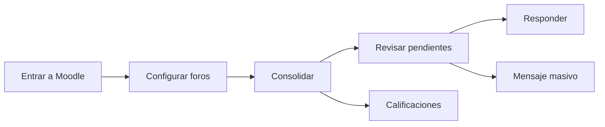
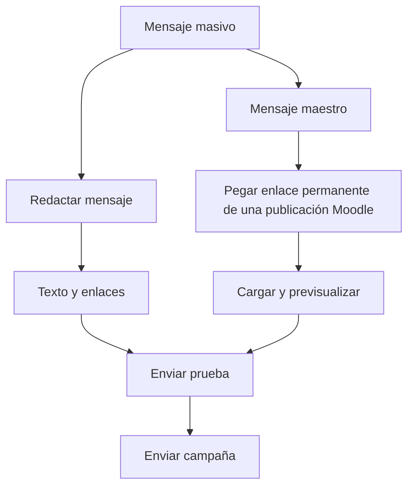

# Moodle Forum Toolkit

**Moodle Forum Toolkit** es un userscript para Tampermonkey orientado a docentes y tutores que trabajan con Moodle y, de forma especial, con flujos habituales de la UNAD.

Versión estable: **1.17.2**  
Autor: **Juan Pablo Moreno Ortiz**  
Licencia: **MIT**  
Donaciones voluntarias: **Llave @moreno3666**

> Herramienta independiente y no oficial. No está afiliada ni respaldada por Moodle Pty Ltd ni por la Universidad Nacional Abierta y a Distancia.

## Qué permite hacer

- Configurar y consolidar varios foros Moodle.
- Detectar grupos separados y foros con grupo único.
- Revisar mensajes en vista lista o árbol de conversaciones.
- Identificar respuestas directas del tutor y pendientes de atención.
- Priorizar mensajes según antigüedad y referencia de 48 horas.
- Responder directamente a publicaciones de estudiantes.
- Consultar archivos adjuntos publicados por estudiantes.
- Gestionar mensajes masivos por dos vías:
  - **Redactar mensaje:** texto y enlaces.
  - **Mensaje maestro:** replica una publicación Moodle existente conservando formato, enlaces e imágenes incrustadas.
- Aplicar prueba previa, pausas y prevención de duplicados en campañas.
- Revisar y usar el correo interno de Moodle cuando la instalación lo ofrece.
- Consolidar actividades de calificación por aula, actividad y grupo.
- Filtrar entregados/no entregados y calificados/no calificados.
- Exportar calificaciones a CSV.
- Descargar adjuntos de entregas desde el panel de calificación.
- Usar una plantilla resumida para diligenciar criterios/rúbricas.
- Preparar retroalimentación para no entregas con revisión manual antes de guardar.
- Prellenar campos SAI en AUREA, incluyendo una **observación editable**.
- Mantener configuraciones separadas por usuario Moodle dentro del mismo navegador.

## Instalación

### 1. Instale Tampermonkey

Instale Tampermonkey en Chrome o Edge y habilite la opción del navegador que permita ejecutar scripts de usuario si aparece disponible.

### 2. Instale Moodle Forum Toolkit

Con Tampermonkey instalado, abra:

**[Instalar / actualizar Moodle Forum Toolkit](https://raw.githubusercontent.com/JuanBiomedico/Moodle-Forum-Toolkit/main/Moodle-Forum-Toolkit.user.js)**

Tampermonkey debería mostrar automáticamente la pantalla de instalación. Pulse **Instalar**.

### 3. Abra Moodle

Ingrese normalmente a Moodle con su cuenta institucional y abra una página de curso, foro o tarea compatible.

El Toolkit usa la sesión del usuario que ya está autenticado. **No solicita usuario, contraseña ni credenciales adicionales.**

## Flujo básico

## Mensajes masivos

La ventana de mensajes masivos tiene dos pestañas independientes.

### Redactar mensaje

Este modo se limita deliberadamente a **texto y enlaces**. La carga local de imágenes y archivos adjuntos está desactivada para evitar errores de compatibilidad con el gestor de archivos de Moodle.

### Mensaje maestro

Permite crear primero el mensaje directamente en Moodle y luego pegar su enlace permanente en el Toolkit.

Ejemplo:

`.../mod/forum/discuss.php?d=35574#p471453`

El Toolkit conserva el HTML, formato, enlaces e imágenes incrustadas de esa publicación. La discusión de origen se omite automáticamente para evitar duplicarla.

Por seguridad, si la publicación maestra contiene **archivos adjuntos**, la réplica se bloquea actualmente. Las imágenes incrustadas sí están soportadas.

## Calificaciones

El módulo de calificaciones permite revisar actividades configuradas, recorrer grupos, aplicar filtros locales sin volver a escanear Moodle y abrir el calificador del estudiante.

Incluye:

- filtros por aula, actividad, grupo, estado de entrega y estado de calificación;
- exportación CSV;
- descarga de adjuntos de entregas;
- plantilla resumida de criterios;
- preparación de cero y retroalimentación para no entregas;
- nombre del tutor tomado del perfil Moodle y editable.

## SAI / AUREA

En la ruta compatible de AUREA aparece un panel de apoyo para:

- **No presentado**.
- **Reprobado / bajo rendimiento**.

El Toolkit propone los campos de acompañamiento y muestra una observación que puede modificarse antes de aplicar el prellenado.

**No guarda ni cierra el registro automáticamente.** El tutor conserva la revisión final.

## Multiusuario

Desde la versión 1.17.0, la configuración se separa por usuario Moodle.

Esto evita que dos profesores que usen el mismo computador y perfil del navegador compartan accidentalmente:

- lista de foros;
- borradores;
- preferencias;
- historial local de campañas;
- configuración de calificación.

La identificación se realiza a partir del usuario actualmente autenticado en Moodle, no mediante un nombre o ID fijo en el script.

## Seguridad y privacidad

- No guarda contraseñas.
- No almacena manualmente cookies de sesión.
- No solicita credenciales.
- Utiliza la sesión Moodle ya abierta en el navegador.
- Las publicaciones requieren acción explícita del tutor.
- Si una publicación queda en estado incierto, se bloquea el reintento automático para reducir duplicados.
- Los datos de configuración se almacenan localmente en el navegador/Tampermonkey.

## Documentación completa

Consulte **[MANUAL_USUARIO.md](MANUAL_USUARIO.md)**.

## Capturas y guía visual

La documentación ya incluye diagramas de flujo renderizados por GitHub. Para una guía aún más visual, se recomienda incorporar capturas reales de:

1. panel principal;
2. configuración de foros;
3. vista Conversaciones;
4. pestañas de Mensaje masivo;
5. panel de Calificaciones;
6. plantilla resumida de criterios;
7. panel SAI.

Las capturas deben ocultar nombres, correos, documentos, notas y cualquier otro dato personal de estudiantes.

## Desarrollo

- **main:** versión estable destinada a instalación.
- **feature/portal-dashboard-v1.11.0:** rama de desarrollo y pruebas.

Las nuevas funciones deben probarse primero en desarrollo y promocionarse a `main` solo cuando sean estables.

## Licencia

MIT. Consulte `LICENSE`.

Copyright © 2026 Juan Pablo Moreno Ortiz.
